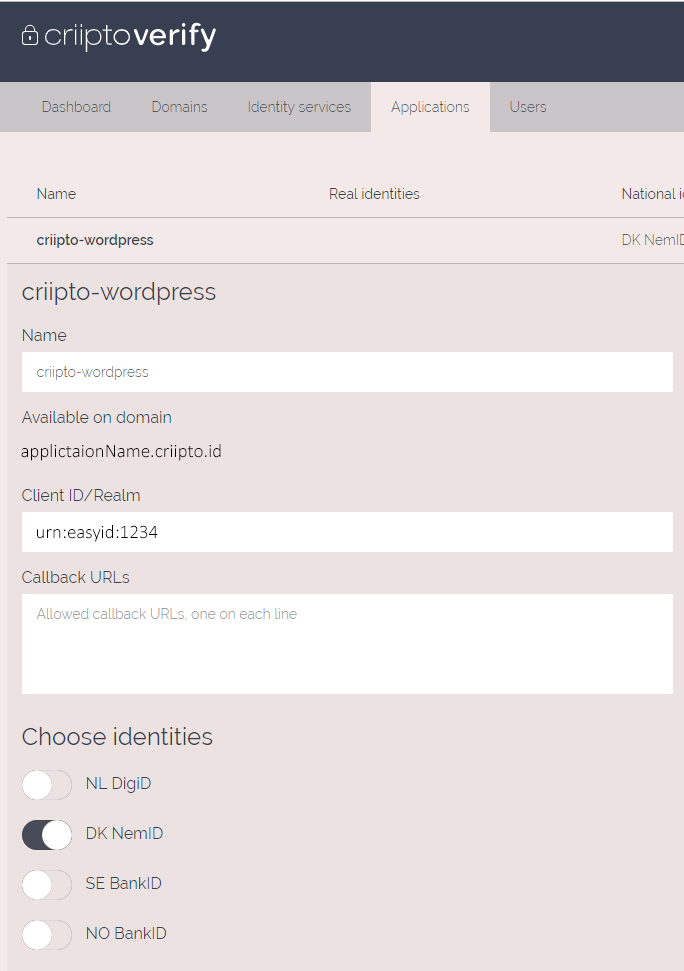

# wp-criipto-verify

wp-criipto-verify is an wordpress plugin that provides login for DK NemId, NO/SE BankId, FI Tupas, FI Mobiilivarmenne, FI All for all your sites.

## Before you get started

You'll need to install wordpress. Guide to isntall wordpress [Install Wordpress](https://wordpress.org/support/article/how-to-install-wordpress/)

## Supported wordpress versions

wp-criipto-verify plugin is supported with wordpress <5.2.

## Installation

1. Download or clone this repository to the plugin folder in your wordpress project. Typicaly "[wordpress project name]"/wp-content/plugins.
2. Activate wp-criipto-verify plugin, by going to wordpress admin -> plugins and press Activate.
3. Sign up a free account on [criipto](https://criipto.com/products/criipto-verify-pricing/#plans)
4. Login to [Criipto manager](manager.criipto.id)
5. Go to applicaton tap, create a new application and follow the steps
6. You should end op having an application looking this

 

7. Add the applications information from manage.criipto.id to criipto settings in wordpress

## Usage

Add this shortcode to wordpress page. Guide to add shortcode to wordpress page [Wordpress support](https://en.support.wordpress.com/wordpress-editor/blocks/shortcode-block/)

```wordpress
[criipto]
```

Supported parameters:
<table>
    <tr>
        <th>Type</th>
        <th>info</th>
        <th>Support</th>
    </tr>
    <tr>
        <td><code>acr_values=</code></td>
        <td width="170px">"Your login method"</td>
        <td>"urn:grn:authn:no:bankid:mobile", "urn:grn:authn:no:bankid:central", "urn:grn:authn:se:bankid:same-device", "urn:grn:authn:se:bankid:another-device", "urn:grn:authn:dk:nemid:poces", "urn:grn:authn:dk:nemid:moces", "urn:grn:authn:dk:nemid:moces:codefile", "urn:grn:authn:nl:digid:basic", "urn:grn:authn:nl:digid:middle", "urn:grn:authn:nl:digid:substantial", "urn:grn:authn:nl:digid:high"</td>
    <tr>
    <tr>
        <td><code>client_id=</code></td>
        <td>"Your Client ID/Realm"</td>
        <td></td>
    <tr>
    <tr>
        <td><code>implicit=</code></td>
        <td>"Return an id token directly"</td>
        <td></td>
    <tr>
    <tr>
        <td><code>domain=</code></td>
        <td>"Your application domain"</td>
        <td></td>
    <tr>
    <tr>
        <td><code>authority=</code></td>
        <td>"https / http"</td>
        <td></td>
    <tr>
    <tr>
        <td><code>port=</code></td>
        <td>"port"</td>
        <td></td>
    <tr>
    <tr>
        <td><code>afterLogOutRedirect=</code></td>
        <td>"Redirect url after log out"</td>
        <td></td>
    <tr>
</table>

Example on how to use parameters:

```wordpress
[criipto acr_values="urn:grn:authn:no:bankid:mobile" domain="applicationName.criipto.id"]
```

## License

[MIT](https://criipto.com/licenses/mit/)
